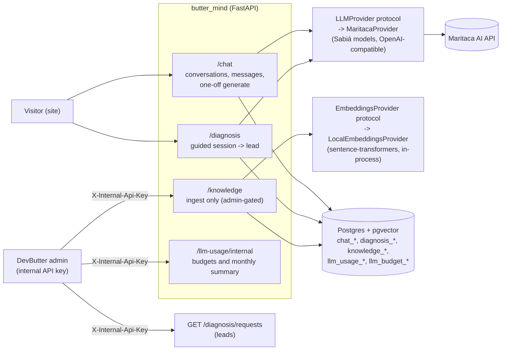
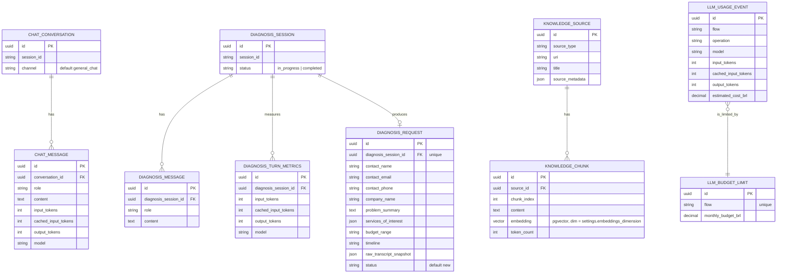
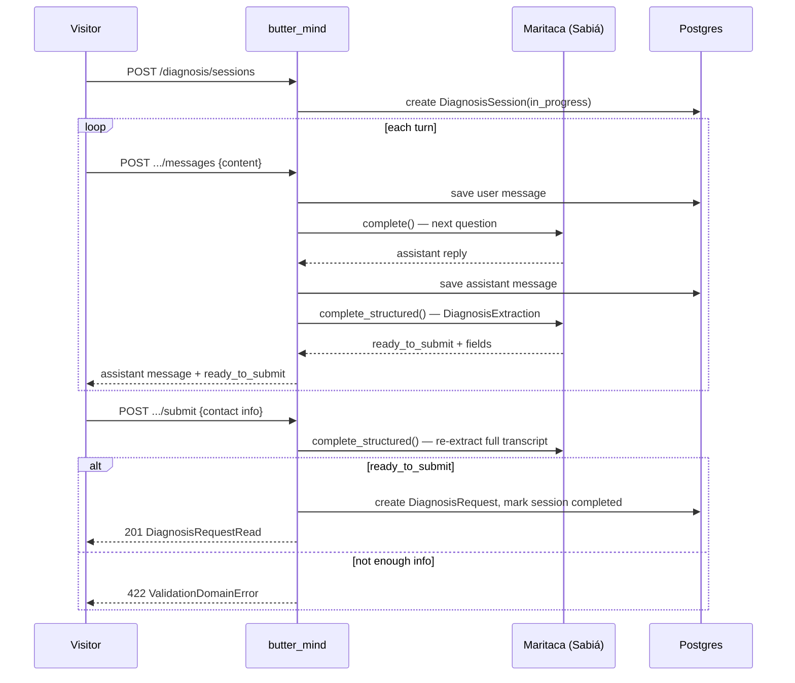

# butter_mind

DevButter's AI backend: guided chat, a structured lead-qualification ("diagnosis") flow, and the
beginning of a RAG knowledge base. One of the five DevButter services (alongside `asaas_payment`,
`butter_relay`, `devbutter_platform`, `devbutter_frontend`) — this is the only one that talks to an
LLM.

- **Chat**: open-ended conversation with the DevButter assistant, plus a stateless one-off text
  generator used to fill dynamic copy on the site.
- **Diagnosis**: a guided Q&A that gathers a visitor's problem, service interest, budget range and
  timeline, then extracts a structured lead (`DiagnosisRequest`) once enough information exists —
  this is the backend for the site's "Solicitar diagnóstico" flow.
- **Knowledge**: sources are chunked, embedded and retrieved for diagnosis turns. The diagnosis
  prompt receives only chunks above the configured similarity threshold; empty retrieval is
  exposed as an ungrounded signal for review.

## Architecture



Every domain follows the same six-file shape used across the DevButter services:
`models.py` → `schemas.py` → `repository.py` → `service.py` → `router.py` → `dependencies.py`.
`dependencies.py` holds the domain's own DI wiring (`get_*_service` factories + their
`Annotated[..., Depends(...)]` aliases); `router.py` is routes only. Cross-domain providers
(`DbSession`, `LLMProviderDep`, `EmbeddingsProviderDep`, the API-key gates) stay in
`core/dependencies.py`.

- **`core/llm/`**: `LLMProvider` is a `Protocol` — `MaritacaProvider` is the only implementation,
  wrapping Maritaca AI's Sabiá models through their OpenAI-compatible SDK surface
  (`responses.create`; `instructions` carries the stable prompt and `input` the dynamic
  conversation, enabling Maritaca prompt cache). Domain services (`ChatService`, `DiagnosisService`) depend on the
  protocol, never on `MaritacaProvider` directly, so swapping providers later doesn't touch them.
- **`core/embeddings/`**: same pattern — `EmbeddingsProvider` protocol, `LocalEmbeddingsProvider`
  runs a `sentence-transformers` model **in-process** (no external embeddings API), lazily loaded
  on first use so importing the module for DI wiring doesn't pay the model-load cost.
- **`core/dependencies.py`**: FastAPI DI wiring — `DbSession`, `LLMProviderDep`,
  `EmbeddingsProviderDep`, and `require_internal_api_key` (fails closed: if
  `INTERNAL_API_KEY` is unset, every gated route 404s rather than opening up).
- **`core/decorators.py`**: `@log_errors` (class decorator) applies `log_call` to every public
  method of a service — one debug line on call, one error+traceback line on exception, always
  re-raised unchanged. Used on every `*Service` class.
- **`core/exceptions.py`**: a small self-registering handler pattern — `@exception_handler(Type)`
  registers a handler, `register_exception_handlers(app)` wires them all onto the FastAPI app at
  startup. Domain code raises `NotFoundError` (404), `ConflictError` (409), or
  `ValidationDomainError` (422) and never touches HTTP status codes directly.
- **`core/llm/exceptions.py`**: `LLMProviderError` → 502, `LLMRateLimitError` → 429 — same
  self-registering pattern, so an upstream Maritaca failure surfaces as a clean HTTP error instead
  of a raw exception.

## Modules

### `chat/`

Open-ended conversation, no qualification logic. `ChatConversation` groups `ChatMessage` rows
(`role`, `content`, token counts, model — token accounting is stored per message for future cost
tracking). `POST /chat/generate` is stateless (no persisted conversation) and is meant for one-off
dynamic copy elsewhere on the site (e.g. a personalized headline) — it takes a free-form `context`
dict merged into the prompt.

### `diagnosis/`

The guided lead-qualification flow — the backend for "Solicitar diagnóstico":

1. `POST /diagnosis/sessions` opens a `DiagnosisSession` (`status=in_progress`).
2. `POST /diagnosis/sessions/{id}/messages` appends the visitor's answer, runs the whole transcript
   through `MaritacaProvider.complete()` for the assistant's next question, **and** separately runs
   a second structured-extraction call (`complete_structured`, `DiagnosisExtraction` schema) to
   decide `ready_to_submit` — two LLM calls per turn.
3. `POST /diagnosis/sessions/{id}/submit` re-runs the extraction once more against the full
   transcript, and — only if `ready_to_submit` — persists a `DiagnosisRequest` (the actual lead:
   contact info, problem summary, services of interest, budget range, timeline, and a JSON snapshot
   of the raw transcript) and marks the session `completed`. A unique constraint on
   `diagnosis_session_id` means a session can only ever produce one `DiagnosisRequest`.
4. `GET /diagnosis/requests` (admin-gated) lists all leads for internal follow-up.
   `GET /diagnosis/internal/dashboard/overview` supplies the aggregate data to the authenticated
   DevButter admin through `devbutter_platform`; the browser never calls this service directly.
   `GET/PATCH /diagnosis/internal/dashboard/settings` exposes only safe diagnosis limits, while
   secrets and infrastructure configuration remain deployment-only.

### `knowledge/`

`POST /knowledge/sources` registers a source and `POST /knowledge/sources/{id}/ingest` naively
chunks raw text (fixed 2000 chars, 200 overlap — a placeholder for future semantic/markdown-aware
splitting), embeds each chunk locally and stores it in `knowledge_chunks`. Diagnosis searches the
stored embeddings, returns the top configured chunks above `diagnosis_grounding_min_score`, and
records their ids/scores per turn. Both ingestion routes require the internal API key.

### `llm_usage/`

Persiste tokens e custo estimado em reais por fluxo (`general_chat`, `site_text_generation`,
`diagnosis_chat`, `diagnosis_extraction`). `PUT /llm-usage/internal/budgets/{flow}` define o
teto mensal; antes de chamar a Maritaca, o serviço compara o saldo com uma estimativa conservadora
do pior caso. `GET /llm-usage/internal/summary` entrega o consumo do mês e os tokens cacheados.
As três rotas são protegidas pela chave interna.

## Data model



## Diagnosis flow (sequence)



## Tech stack

| Layer | Choice |
|---|---|
| Framework | FastAPI (async), Poetry-managed |
| Persistence | SQLAlchemy 2.0 (async) + Alembic, Postgres 16 + **pgvector** |
| LLM | Maritaca AI (Sabiá models) via `openai` SDK against a custom `base_url` |
| Embeddings | `sentence-transformers` (`paraphrase-multilingual-mpnet-base-v2`, 768-dim), in-process |
| CLI | `typer` (`app db heads/history/migrate/rollback/make`) |
| Testing | `pytest` + `pytest-asyncio` + `httpx`, `aiosqlite` for tests |

## Project structure

```
app/
├── main.py           # FastAPI() wiring: middleware, exception handlers, routers, /health
├── cli.py            # `app db ...` Typer CLI wrapping Alembic
├── settings/         # config.py (env), logging_config.py, middleware.py (CORS + request-id log)
├── core/
│   ├── decorators.py     # log_call / log_errors
│   ├── dependencies.py   # DI: DbSession, LLMProviderDep, EmbeddingsProviderDep, internal-key gate
│   ├── exceptions.py     # self-registering domain exception -> HTTP mapping
│   ├── llm/              # LLMProvider protocol + MaritacaProvider + its own exceptions
│   └── embeddings/       # EmbeddingsProvider protocol + LocalEmbeddingsProvider
├── db/               # base.py (DeclarativeBase), session.py, all_models.py (Alembic autogenerate)
├── <domain>/         # each: models/schemas/repository/service/router/dependencies.py
├── chat/             # open-ended conversation + one-off generate
├── diagnosis/        # guided lead-qualification flow
└── knowledge/        # ingest-only RAG source/chunk storage
alembic/              # migrations
tests/                # pytest suite
```

## Local development

```bash
docker compose up -d db
poetry install
poetry run app db migrate
poetry run uvicorn app.main:app --reload
```

Open `http://localhost:8000/docs`. `docker-compose.yml` also joins the shared `devbutter_shared`
Docker network as `mind-api`, the hostname `devbutter_platform` uses to reach this service
(`core/clients/butter_mind_client.py` there).

### Database CLI

```bash
poetry run app db heads
poetry run app db make "description of the change"
poetry run app db migrate
poetry run app db rollback
poetry run app db history
```

### Environment variables

| Variable | Default | Notes |
|---|---|---|
| `DEBUG` | `false` | Enables SQLAlchemy `echo` |
| `LOG_LEVEL` | `INFO` | |
| `DATABASE_HOST` / `PORT` / `USER` / `PASSWORD` / `NAME` | `db` / `5432` / `butter_mind` | Pydantic monta `postgresql+asyncpg://` |
| `CORS_ALLOWED_ORIGINS` | `["http://localhost:3000"]` | JSON list |
| `CORS_ALLOWED_ORIGIN_REGEX` | — | |
| `MARITACA_API_KEY` | — | Required for any `/chat` or `/diagnosis` call to work |
| `MARITACA_BASE_URL` | `https://chat.maritaca.ai/api` | |
| `MARITACA_MODEL` | `sabia-4` | `.env.example` suggests `sabiazinho-4-br-sp` for local/dev cost |
| `EMBEDDINGS_MODEL_NAME` | `paraphrase-multilingual-mpnet-base-v2` | Changing requires a migration + full re-embed (dimension is pinned in the `knowledge_chunks` column) |
| `EMBEDDINGS_DIMENSION` | `768` | |
| `INTERNAL_API_KEY` | — | Gates `/knowledge/*` and `GET /diagnosis/requests`. **Unset = those routes always 404** (fails closed) |

## Known gaps

- **`POST /chat/generate` and the whole `/chat` surface have no auth, rate limit, or per-visitor
  quota.** Anything hitting these endpoints burns Maritaca API budget; today nothing caps abuse
  (repeated calls, scripted traffic) beyond CORS origin restriction, which doesn't stop
  server-to-server abuse.
- **Knowledge base has no retrieval.** Ingestion, chunking, and embedding are implemented; nothing
  queries `knowledge_chunks` yet, so neither `chat` nor `diagnosis` is actually RAG-augmented —
  the diagnosis assistant's knowledge of DevButter's services/pricing today comes only from the
  system prompt, not from any maintained knowledge source (the architecture doc for
  `devbutter_platform` explicitly calls out "DevButter's own service/pricing knowledge as a
  maintained context source" as a requirement that isn't wired up yet).
- **`.env.example` and `Settings` disagree on the default model.** The code default
  (`Settings.maritaca_model`) is `sabia-4`; `.env.example` ships `sabiazinho-4-br-sp` (the cheaper
  model) with no comment explaining the discrepancy — worth reconciling so a fresh
  `cp .env.example .env` doesn't silently run a different model than someone reading `config.py`
  would expect.
- **Two LLM calls per diagnosis turn, plus a third on submit.** `send_message` calls `complete()`
  then `complete_structured()` every turn; `submit()` re-runs `complete_structured()` a third time
  against the same-or-larger transcript. Functionally fine, but each round trip is real latency and
  Maritaca API cost — worth revisiting once usage volume matters (e.g. only re-extract on submit,
  trust the last per-turn `ready_to_submit` otherwise).
- **No embeddings-model versioning.** `KnowledgeChunk.embedding`'s dimension is enforced only by
  column type, not tracked per-row — if the model changes later there's no way to tell old vs. new
  embeddings apart in the same table (flagged in a comment in `knowledge/models.py`).
- **No tests reviewed in this pass** beyond confirming a `tests/` directory and `pytest`/`httpx`/
  `aiosqlite` dependencies exist — verify actual coverage before relying on this doc's confidence
  in behavior beyond what's described above.
